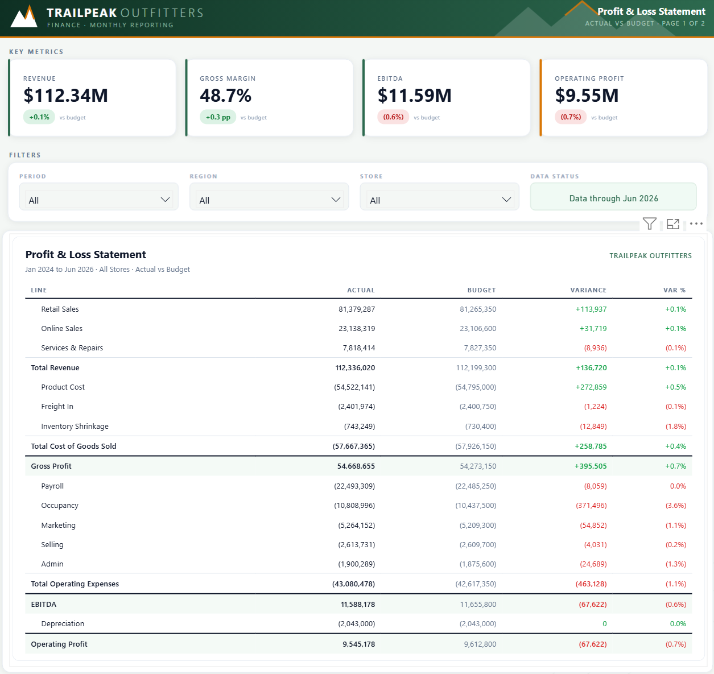

# Code-First Power BI Report Design

**From an Excalidraw sketch to a production Power BI report, with a coding agent writing every layer: the canvas, the visuals, and the model.**

This repo is the complete, reproducible proof-of-concept behind my blog post *"Stop Designing Power BI Reports in PowerPoint: A Code-First Workflow from an Excalidraw Sketch to Production."* Everything here is synthetic and fictional (TrailPeak Outfitters, a made-up outdoor gear retailer), generated by one seeded Python script, so you can clone it, rebuild it, and pull it apart freely.



## Try it live

| Version | What it proves | Link |
|---|---|---|
| **HTML prototype version** | The design iteration loop: the whole P&L statement and Pareto chart are DAX measures returning HTML/SVG | [Open the live report](https://app.powerbi.com/view?r=eyJrIjoiMzRkN2UwODEtM2FiMC00OGU2LWJlZGMtOGI5YzRjNmMxYmE3IiwidCI6IjVlZTM0M2M1LTMwMDAtNDZiOC1hMmM4LTMxMTNlZDYzMzk5MyJ9) |
| **Deneb production version** | The same design rebuilt in Deneb (Vega-Lite): cross-filtering, native tooltips, context menus, and real data export | [Open the live report](https://app.powerbi.com/view?r=eyJrIjoiMTljMTc1YTQtYWRlMi00YTNjLWFiNzQtYzQzN2ZmNDdhMDNhIiwidCI6IjVlZTM0M2M1LTMwMDAtNDZiOC1hMmM4LTMxMTNlZDYzMzk5MyJ9) |

Note: these are publish-to-web embeds, and Power BI disables Export data for anonymous viewers on that channel. To run the export experiment yourself (HTML visual exports raw markup, Deneb exports clean rows), open the PBIX files from `reports/` in Power BI Desktop.

## The workflow

1. **Sketch** the report as a rough Excalidraw wireframe. The file is JSON, so a coding agent reads the layout directly (`design-assets/*.excalidraw`).
2. **Canvas**: the agent generates the page's static design as HTML/SVG, rendered to a PNG at exact page size and applied as the canvas background (`design-assets/canvas-*.html`).
3. **Prototype**: bespoke visuals are built as DAX measures returning HTML/SVG, hosted in the HTML Content visual, iterating against the live semantic model (`prototypes/*.dax`).
4. **Production**: anything users slice, click, or pull to Excel is rebuilt as a Deneb (Vega-Lite) visual, authored as code straight into the PBIR report definition (`reports/pbip/`).
5. **Estate**: the accumulated design language (theme tokens, specs, measures, layout grid) turns report number two into an automation job.

The decision rule that drives step 4, and the heart of the blog post: **will anyone slice it, click it, or pull it to Excel?** If a native visual does the job, ship the native visual. If not, prototype in HTML, then ship in Deneb. HTML visuals render beautifully but export raw markup instead of rows; Deneb binds real model fields, so the standard Export data command returns a clean table.

## What's in this repo

```
CodeFirstPowerBI/
├── reports/
│   ├── Report (HTML VERSION).pbix    turnkey: the prototype-stage report
│   ├── Report (DENEB VERSION).pbix   turnkey: the production-stage report (4 pages)
│   └── pbip/                         the same report as code: PBIR JSON + TMDL source
├── data/
│   ├── generate_data.py              seeded generator: star schema, anomalies, Pareto shape
│   └── csv/                          9 CSVs: 4 dims, 1 statement layout + bridge, 3 facts
├── prototypes/
│   ├── html_pnl_statement.dax        the full P&L statement page as ONE DAX measure
│   ├── html_pareto_analysis.dax      the full Pareto page (inline SVG) as ONE DAX measure
│   └── kpi_card_measures.dax         8 KPI tiles as HTML-returning measures
├── design-assets/
│   ├── wireframe-*.excalidraw/.png   step 1: the sketches, annotations included
│   ├── canvas-*.html/.png            step 2: generated canvas backgrounds (code + render)
│   ├── LAYOUT-GUIDE.md               the pixel grid every visual snaps to
│   └── report-page-*.png             the finished pages
└── docs/
    ├── SCENARIO.md                   the business story and page plan
    ├── MODEL.md                      star schema, relationships, measure design decisions
    └── RESEARCH-LEARNINGS.md         the verified research notes behind the blog
```

## The data

TrailPeak Outfitters: 12 stores, 4 regions, 120 SKUs, 30 closed months (Jan 2024 to Jun 2026) plus a full-year 2026 budget. Everything reconciles: product-level sales tie to the P&L revenue and cost lines to the cent, and the catalog is engineered so the top 20% of SKUs carry ~77% of revenue (a textbook Pareto). Four anomalies are planted for variance analysis to find: a rent spike, a regional ad overspend, an underperforming store, and a one-month shrinkage incident. Regenerate everything with:

```bash
cd data
python generate_data.py
```

Deterministic (seed 42), stdlib only, self-validating (FK integrity, reconciliation, Pareto shape, anomaly presence).

## Rebuilding from source

The PBIX files work out of the box. To work with the code form instead:

1. Regenerate the CSVs (above), or use the ones in `data/csv/`.
2. The PBIP source in `reports/pbip/` references the data at `C:\CodeFirstPowerBI\data\csv\`. Either clone to `C:\CodeFirstPowerBI`, or find-and-replace that path in `reports/pbip/Report/Report.SemanticModel/definition/tables/*.tmdl`.
3. Open `reports/pbip/Report/Report.pbip` in Power BI Desktop and refresh.
4. Install the two free custom visuals from AppSource: **HTML Content** and **Deneb** (both by Daniel Marsh-Patrick, both MIT licensed).

## Field notes (the gotchas that cost hours so yours cost minutes)

- **Canvas backgrounds**: render to PNG at exact page size, apply with transparency 0% (the default is 100%, which looks like a failure). Raw SVG backgrounds have an unresolved clipping bug. Never put data-driven text in the background.
- **HTML measures**: FORMAT(), never TEXT(). Never set a numeric format string on a measure that returns markup. Measures hold ~2.1M characters; columns silently truncate at 32,766.
- **Deneb / Vega-Lite 6.4.1**: an encoding-less rule mark crashes the compiler and the visual renders blank (draw thin rects instead); the band anchor is ignored for rules (offset by half the bandwidth with an expression); DAX BLANK() arrives as null and text layers will print the word "null" unless you filter with isValid(). Debug specs locally with vl-convert instead of the visual editor.
- **Export governance**: certification buys PDF/PowerPoint export rendering and subscription emails, not Export data. Export data is governed by report settings, tenant settings, and the consumption channel; publish to web disables it entirely for anonymous viewers. Verify in the channel your users actually use.
- **Pareto in DAX**: rank with a key tiebreak so ties never desync the cumulative line, and blank-guard every measure so products without sales stay out of the visual.

## Toolchain

Built with [Claude Code](https://claude.com/claude-code) driving the authoring loop, the [power-bi-agentic-development](https://github.com/data-goblin/power-bi-agentic-development) plugin toolkit (PBIP validation, TMDL and Deneb skills), [Deneb](https://deneb.guide/) and [HTML Content](https://html-content.com/) by Daniel Marsh-Patrick, [Excalidraw](https://excalidraw.com/) for wireframes, and [vl-convert](https://github.com/vega/vl-convert) for local Vega-Lite debugging.

## Disclaimer

All company names, people, and numbers in this repository are fictional and synthetically generated. No client data, branding, or artifacts are included.

## Author

**Sulaiman Ahmed** · [LinkedIn](https://www.linkedin.com/in/sulaimanahmed)

If you build something with this workflow, I would love to see it.
